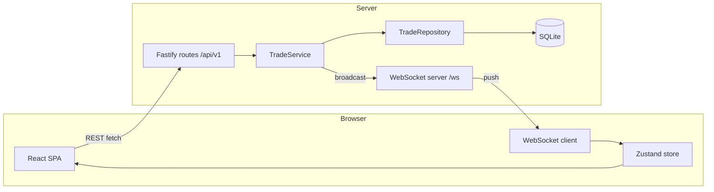
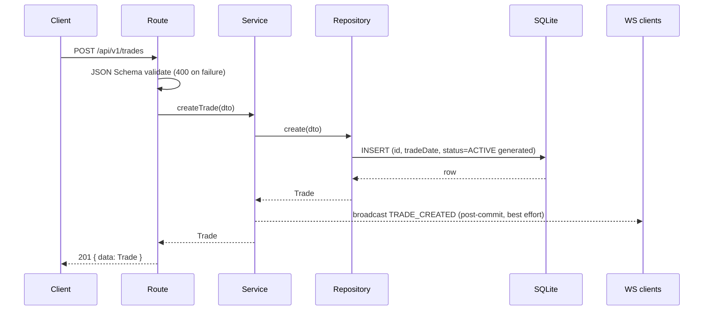

# Design Document: Trade Blotter

## Overview

The Trade Blotter is a full-stack, real-time trading-desk application. The backend is
a Fastify + TypeScript API over SQLite (better-sqlite3) that broadcasts every mutation
to connected clients over native WebSockets. The frontend is a React 18 + TypeScript +
Vite SPA using TanStack Table for the grid, Zustand for live trade state, TanStack Query
for server-state fetching, and React Hook Form + Zod for forms.

The design goals, in priority order, follow the assessment weighting: engineering
quality (clean layering, maintainability), TypeScript rigour (branded IDs, discriminated
unions, no `any`), coherent full-stack interaction (one consistent API + WS contract),
thoughtful UX, and sensible automated testing.

This document is the technical companion to requirements.md. Acceptance criteria are
referenced by number (e.g. 4.2). Correctness properties are numbered (Property 1-26) and
referenced from tasks.md; each property-based test is tagged
`// Feature: trade-blotter, Property N: <text>`.

---

## Architecture

### High-level system



The client reads/writes over REST and receives state changes over the WebSocket. After a
mutation the server persists first, then broadcasts; the originating client updates its
store from the broadcast (not the HTTP response), so all clients follow one code path.

### Backend layering (SOLID)

Strict dependency direction: `routes -> service -> repository -> db`. Higher layers depend
on abstractions (`ITradeService`, `ITradeRepository`), never concrete classes. Concrete
wiring happens only at the composition root (`server.ts`).

- **routes/** - HTTP only: parse/validate input (Fastify JSON Schema), call the service,
  shape the response. No business logic, no SQL.
- **services/** - business rules (e.g. a CANCELLED trade cannot be amended), aggregation
  (positions, P&L), and the commit-then-broadcast side effect. No SQL, no HTTP parsing.
- **db/** - the only place SQL lives; maps `snake_case` rows to the `camelCase` domain
  model and never leaks row types outward.
- **websocket/** - transport concern: upgrade handling on `/ws`, connection ack, and the
  broadcast fan-out.
- **utils/** - `AppError`, id generation, field diffing (pure, unit-testable).

### Frontend layering

- **services/** - `api.client` (typed fetch wrapper -> `ApiError`), `trade.api` (endpoint
  functions), `websocket.client` (singleton socket + reconnect), `config/env` (single
  source of API/WS URL resolution).
- **store/** - Zustand trade store; the live source of truth the grid renders from.
- **hooks/** - React Query queries/mutations and the `useTradeSocket` bridge.
- **features/** - blotter (grid), forms (create/amend), audit, analytics (positions/P&L).
- **components/** - reusable UI (Modal, ToastContainer, ErrorBoundary, ConnectionStatusBanner).

---

## Components and Interfaces

### Domain types (shared source of truth)

Defined in `backend/src/types/trade.types.ts` and mirrored in the frontend. Key contracts:

```typescript
export type TradeId = string & { readonly __brand: 'TradeId' };
export declare function createTradeId(raw: string): TradeId;

export const TradeSide = { BUY: 'BUY', SELL: 'SELL' } as const;
export type TradeSide = (typeof TradeSide)[keyof typeof TradeSide];

export const TradeStatus = { ACTIVE: 'ACTIVE', CANCELLED: 'CANCELLED' } as const;
export type TradeStatus = (typeof TradeStatus)[keyof typeof TradeStatus];

export interface Trade {
  id: TradeId;
  symbol: string;
  quantity: number;
  price: number;
  side: TradeSide;
  trader: string;
  tradeDate: string;
  status: TradeStatus;
  book: string;
  counterparty: string;
}

export type CreateTradeRequest = Omit<Trade, 'id' | 'tradeDate' | 'status'>;
export type AmendTradeRequest  = Partial<Omit<Trade, 'id' | 'tradeDate'>>;

export type WsMessage =
  | { type: 'TRADE_CREATED';   payload: Readonly<Trade> }
  | { type: 'TRADE_AMENDED';   payload: Readonly<Trade> }
  | { type: 'TRADE_CANCELLED'; payload: { id: TradeId } }
  | { type: 'CONNECTION_ACK';  payload: { message: string } }
  | { type: 'PRICE_TICK';      payload: Record<string, number> };
```

The `Trade` interface extends the brief's minimum model with `book` and `counterparty`
(explicitly permitted). `tradeDate` is the canonical timestamp field name (the brief's
interface uses `tradeDate`; its sample JSON uses `tradeTimestamp` - we standardise on
`tradeDate`).

### Repository contract

```typescript
export interface ITradeRepository {
  findAll(filters?: TradeFilters): Trade[];
  findById(id: TradeId): Trade | null;
  create(trade: NewTrade): Trade;
  update(id: TradeId, fields: Partial<Trade>, auditEntries: AuditInsert[]): Trade;
  cancel(id: TradeId): Trade;
  findAuditHistory(tradeId: TradeId): AuditEntry[];
  findAllAuditEntries(limit: number): AuditEntry[];
  getActiveTrades(): Trade[];
}
```

Fully substitutable (Liskov): the in-memory mock used in tests behaves identically to the
SQLite-backed implementation from the caller's view.

### Service contract

```typescript
export interface ITradeService {
  getAllTrades(filters?: TradeFilters, pagination?: PaginationParams): PaginatedResult<Trade>;
  getTradeById(id: TradeId): Trade;
  createTrade(dto: CreateTradeRequest): Trade;
  createRandomTrades(count: number): number;
  amendTrade(id: TradeId, dto: AmendTradeRequest): Trade;
  cancelTrade(id: TradeId): Trade;
  getAuditHistory(id: TradeId): AuditEntry[];
  getRecentAuditEntries(limit?: number): AuditEntry[];
  getPositionSummary(): PositionSummary[];
  getPnlSummary(): PnlSummary[];
}
```

### REST API contract

Base URL `/api/v1`. Success responses are `{ data }` (collections add `meta`); errors are
`{ error: { code, message, statusCode, fields? } }`.

| Method | Path | Success | Errors |
|--------|------|---------|--------|
| GET | `/trades` | 200 `{ data, meta }` | - |
| POST | `/trades` | 201 `{ data }` | 400 VALIDATION_ERROR |
| GET | `/trades/:id` | 200 `{ data }` | 404 TRADE_NOT_FOUND |
| PATCH | `/trades/:id` | 200 `{ data }` | 400, 404, 409 TRADE_CANCELLED |
| DELETE | `/trades/:id` | 200 `{ data }` | 404, 409 TRADE_ALREADY_CANCELLED |
| GET | `/trades/:id/audit` | 200 `{ data, meta }` | 404 TRADE_NOT_FOUND |
| GET | `/audit` | 200 `{ data, meta }` | - |
| GET | `/positions` | 200 `{ data }` | - |
| GET | `/pnl` | 200 `{ data }` | - |
| GET | `/prices` | 200 `{ data }` | - |
| POST | `/trades/random` | 201 `{ data: { created } }` | 400 |

`GET /trades` query params: `symbol`, `side`, `status`, `trader`, `page` (default 1),
`pageSize` (default 50). Filters apply conjunctively.

Create/amend validation (Fastify JSON Schema): `symbol` non-empty and `^[A-Z]+$`;
`quantity` integer `>= 1`; `price` number `exclusiveMinimum 0`; `side` in {BUY, SELL};
`trader`, `book`, `counterparty` non-empty. Unknown body fields are rejected (400) rather
than silently stripped.

### WebSocket protocol

Connect to `/ws` (same port as the API, attached via the HTTP `upgrade` event; non-`/ws`
upgrades get 404). Server-to-client only. On connect the client receives
`CONNECTION_ACK`. After each successful mutation the server broadcasts the affected trade
(`TRADE_CREATED`/`TRADE_AMENDED` carry the full trade; `TRADE_CANCELLED` carries `{ id }`).
A simulated `PRICE_TICK` feeds mark-to-market for the P&L view. Nothing is broadcast on a
failed operation. A per-client send failure never blocks delivery to other clients.

Client reconnect uses bounded exponential backoff: `delay = min(1000 * 2^(n-1), 30000)`.

---

## Data Models

### Database schema (SQLite)

```sql
CREATE TABLE IF NOT EXISTS trades (
  id           TEXT PRIMARY KEY,
  symbol       TEXT NOT NULL,
  quantity     INTEGER NOT NULL CHECK (quantity > 0),
  price        REAL NOT NULL CHECK (price > 0),
  side         TEXT NOT NULL CHECK (side IN ('BUY', 'SELL')),
  trader       TEXT NOT NULL,
  trade_date   TEXT NOT NULL,
  status       TEXT NOT NULL DEFAULT 'ACTIVE' CHECK (status IN ('ACTIVE', 'CANCELLED')),
  book         TEXT NOT NULL,
  counterparty TEXT NOT NULL
);

CREATE TABLE IF NOT EXISTS trade_audit (
  id           INTEGER PRIMARY KEY AUTOINCREMENT,
  trade_id     TEXT NOT NULL REFERENCES trades(id),
  field        TEXT NOT NULL,
  old_value    TEXT,
  new_value    TEXT,
  changed_at   TEXT NOT NULL,
  changed_by   TEXT NOT NULL DEFAULT 'SYSTEM'
);

CREATE INDEX IF NOT EXISTS idx_trades_symbol   ON trades(symbol);
CREATE INDEX IF NOT EXISTS idx_trades_trader   ON trades(trader);
CREATE INDEX IF NOT EXISTS idx_trades_status   ON trades(status);
CREATE INDEX IF NOT EXISTS idx_audit_trade_id  ON trade_audit(trade_id);
```

Notes:
- CHECK constraints enforce domain invariants at the storage layer as a second line of
  defence behind request validation.
- Column names are `snake_case`; the repository maps `trade_date -> tradeDate` etc. and
  never lets row types escape.
- Migrations are idempotent (`IF NOT EXISTS`) and run synchronously on startup before any
  route is registered. SQLite runs in WAL mode.
- Cancel is a soft status transition; rows are retained for the audit trail.

### Seed data

When the table is empty, the system seeds 500 trades (IDs `TRD-100001`..`TRD-100500`) in a
single transaction, drawing symbols/books/counterparties/traders from fixed sets, with
quantity in [100, 10000] and price in [10.00, 1000.00]. This sits inside the brief's
100-1,000 guidance; seeding is the optional startup behaviour the brief describes.

### Aggregate read models

`getPositionSummary()` and `getPnlSummary()` aggregate in memory over ACTIVE trades only
(CANCELLED excluded), grouped by symbol, ordered by symbol ascending. Position:
`netQuantity = sum(BUY qty) - sum(SELL qty)`. P&L is notional-based:
`realizedPnl = sellNotional - buyNotional` (not mark-to-market; there is no real market feed).

---

## Sequence: create trade (end to end)



Consistency model: commit-then-broadcast, no rollback on broadcast failure. If the
broadcast throws, it is logged and the committed 201 still returns. Disconnected clients
recover by refetching on reconnect.

---

## Error Handling

Error codes (backend): `TRADE_NOT_FOUND` (404), `TRADE_CANCELLED` (409),
`TRADE_ALREADY_CANCELLED` (409), `VALIDATION_ERROR` (400), `INTERNAL_ERROR` (500).

- Backend: every domain failure is an `AppError(code, message, statusCode, cause?)`. A
  global Fastify error handler maps `AppError` to `{ error: { code, message, statusCode } }`,
  maps Fastify validation failures to 400 `VALIDATION_ERROR` (with a `fields` map), and
  converts anything unexpected to a generic 500 `INTERNAL_ERROR` without leaking internals.
  4xx logged at `warn`, 5xx at `error`.
- Frontend: `ApiError(code, message, statusCode)` with `statusCode: 0` for network
  failures; the `fetchApi` wrapper never lets a raw fetch rejection escape. A React error
  boundary provides a reload fallback. Failed mutations never mutate the store.

---

## Testing Strategy

Co-located tests, TDD (red-green-refactor). Vitest on both sides; backend adds fast-check
(property-based, min 100 iterations); frontend adds React Testing Library and MSW.

- **Backend:** repository tested against real `:memory:` SQLite; service tested against a
  mocked repository + broadcast; routes tested via Fastify `inject`; a full smoke test wires
  a real app over in-memory SQLite.
- **Frontend:** hooks, store, components, and the API client (via MSW) tested in jsdom.

---

## Correctness Properties

Properties 1-26 (each backed by a fast-check property-based test, min 100 iterations):

### Property 1: Database row mapping round-trip (repository).

**Validates: Requirements 2.7, 3.1**

### Property 2: Trade ID format `^TRD-\d{6}$` (idGenerator).

**Validates: Requirements 2.3**

### Property 3: Seed data field constraints.

**Validates: Requirements 2.2, 2.4, 2.5**

### Property 4: Filter correctness (all returned trades satisfy all filters).

**Validates: Requirements 3.3**

### Property 5: Pagination count invariant.

**Validates: Requirements 3.4, 3.5**

### Property 6: Trade creation preserves all supplied fields.

**Validates: Requirements 4.1, 4.7**

### Property 7: Invalid input produces VALIDATION_ERROR.

**Validates: Requirements 4.2, 4.3, 4.4, 4.5, 4.6**

### Property 8: Broadcast failure does not roll back trade creation.

**Validates: Requirements 4.7, 8.7**

### Property 9: Amendment updates only supplied fields.

**Validates: Requirements 5.1, 5.5, 5.6**

### Property 10: Cancellation sets status without deleting the row.

**Validates: Requirements 6.1, 6.4**

### Property 11: Audit row count equals changed-field count.

**Validates: Requirements 7.1, 7.3**

### Property 12: Diff excludes unchanged and absent fields.

**Validates: Requirements 7.3**

### Property 13: Service preserves repository ordering and pagination.

**Validates: Requirements 3.3, 3.4**

### Property 14: Amendment and audit atomicity (transaction rolls back together).

**Validates: Requirements 7.7**

### Property 15: CONNECTION_ACK sent to every new client.

**Validates: Requirements 8.1**

### Property 16: WebSocket store updates correct for all message types.

**Validates: Requirements 8.2, 8.3, 8.4**

### Property 17: Exponential backoff is bounded (<= 30000ms).

**Validates: Requirements 8.5**

### Property 18: Broadcast reaches all connected clients.

**Validates: Requirements 8.7**

### Property 19: Unknown WebSocket message does not mutate the store.

**Validates: Requirements 8.8**

### Property 20: CANCELLED trade row renders with both visual indicators (opacity + strikethrough).

**Validates: Requirements 9.5**

### Property 21: Form validation rejects all invalid inputs (no API call).

**Validates: Requirements 10.2, 10.5, 11.4**

### Property 22: Amend form pre-populates all fields.

**Validates: Requirements 11.2**

### Property 23: Timestamp formatting is human-readable local time (no T/Z).

**Validates: Requirements 13.4**

### Property 24: AppError produces a consistent error response shape.

**Validates: Requirements 14.1**

### Property 25: API client parses error bodies into ApiError.

**Validates: Requirements 14.2**

### Property 26: Failed mutations do not mutate the trade store.

**Validates: Requirements 14.4**

Coverage targets: services >= 90%, repository >= 85%, routes >= 80%, frontend hooks and
components >= 80%.

---

## Deployment and Configuration

- **Local Docker:** root `docker-compose.yml` builds and runs both services;
  `docker compose up --build` is the single start command. The frontend nginx image
  reverse-proxies `/api` and `/ws` to the backend so the SPA is served same-origin.
- **URL resolution:** `frontend/src/config/env.ts` is the single source; `API_BASE`
  defaults to `/api/v1` and `resolveWsUrl()` derives `ws(s)://<host>/ws`. `VITE_*` are
  optional dev-only overrides, so one frontend build works for local Docker and hosting
  without a rebuild.
- **Backend config:** `DB_PATH`, `PORT`, `CORS_ORIGIN` read from the environment; the
  server binds `0.0.0.0` on `PORT`.
- **Hosted (Render):** `render.yaml` describes a Docker web service for the backend with a
  persistent disk at `DB_PATH` so SQLite survives restarts. Without a disk the filesystem is
  ephemeral and `seedIfEmpty` re-seeds 500 trades on every empty startup (documented demo
  trade-off). A long-lived stateful container host is required (not serverless/edge) because
  the app holds persistent WebSocket connections and writes a SQLite file.

---

## Design Decisions and Trade-offs

- **Fastify over Express/NestJS:** first-class TS typing and built-in JSON Schema
  validation at the edge; lighter than NestJS's decorator/module ceremony for this scope.
- **SQLite (better-sqlite3) over Postgres/Mongo:** zero-config, file-based, synchronous
  (honest repository, no fake async). Behind `ITradeRepository`, so swapping to Postgres is
  a new implementation + connection change, not a service/route rewrite. Trade-off: single
  instance, not horizontally scalable.
- **Native ws over Socket.IO:** the requirement is JSON broadcast; native ws + the browser
  WebSocket API meets it without an extra protocol/client layer.
- **TanStack Table (+ Virtual) over AG Grid:** headless and semantic, keeps the grid markup
  accessible and fully controllable; virtualisation handles large streamed sets.
- **Zustand over Redux:** small global trade state with simple update patterns; server
  state stays in TanStack Query, WS updates patch the Zustand store directly.
- **No optimistic updates:** the store updates only after the server-confirmed broadcast,
  keeping displayed and server state in lockstep at the cost of a small round-trip delay.
- **No authentication:** out of scope for this exercise; all audit entries are attributed to
  `SYSTEM`. A documented assumption, not an oversight.
