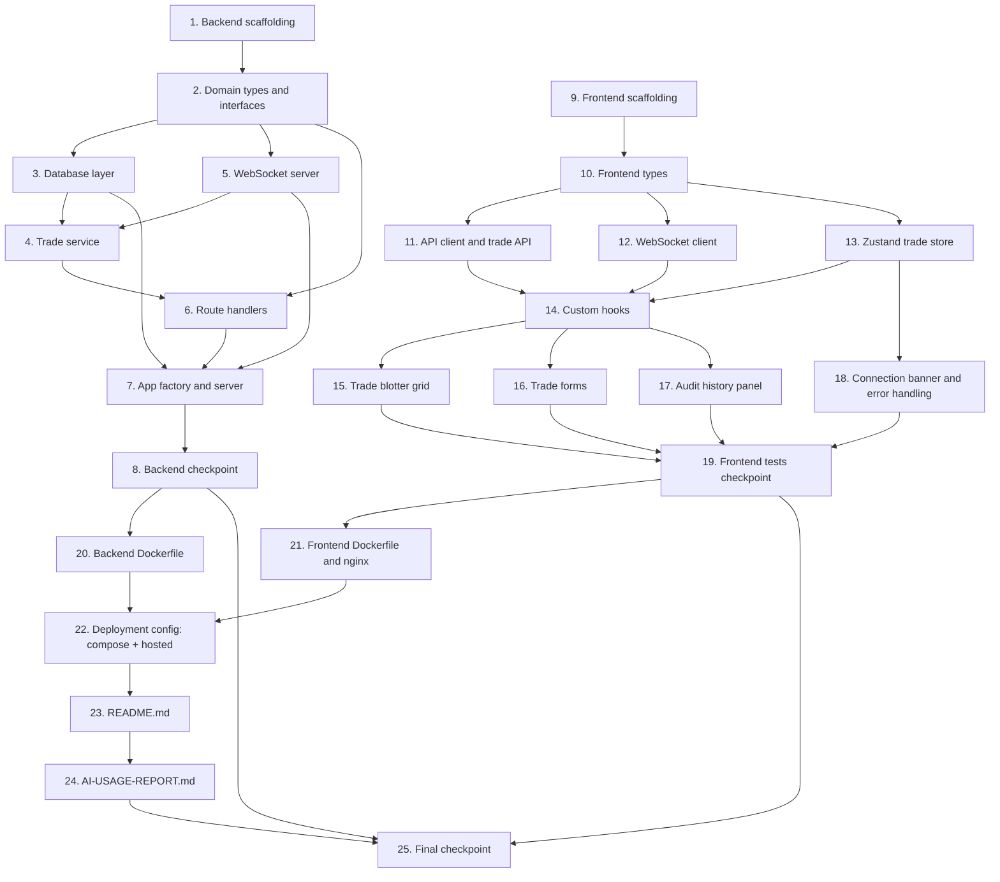

# Implementation Plan: Trade Blotter

## Overview

Full-stack implementation of the trade blotter application: a Fastify + TypeScript backend with SQLite persistence and WebSocket broadcast, a React 18 + TypeScript + Vite frontend with TanStack Table, Zustand, and TanStack Query, wired together and containerised via Docker Compose.

Dependencies flow strictly: types first → DB layer → service → routes → app wiring → frontend types → API client → store → hooks → components → infrastructure.

Tests are co-located with source files and follow TDD: write the failing test before (or concurrently with) the implementation, confirm red → green → refactor. Property-based tests use `fast-check` and run a minimum of 100 iterations.

---

## Task Dependency Graph



Backend (tasks 1–8) and frontend (tasks 9–19) can proceed in parallel. Both must complete before infrastructure (tasks 20–25, including task 22 which now covers both the docker-compose file and the hosted-deployment config). The frontend depends on the backend API contract (defined in task 2 types), which is mirrored in task 10.

```json
{
  "waves": [
    { "wave": 1, "tasks": ["1", "9"] },
    { "wave": 2, "tasks": ["2", "10"] },
    { "wave": 3, "tasks": ["3", "5", "11", "12", "13"] },
    { "wave": 4, "tasks": ["4", "14", "18"] },
    { "wave": 5, "tasks": ["6", "15", "16", "17"] },
    { "wave": 6, "tasks": ["7", "19"] },
    { "wave": 7, "tasks": ["8", "20", "21"] },
    { "wave": 8, "tasks": ["22"] },
    { "wave": 9, "tasks": ["23"] },
    { "wave": 10, "tasks": ["24"] },
    { "wave": 11, "tasks": ["25"] }
  ]
}
```

---

## Tasks

- [ ] 1. Backend project scaffolding
  - Initialise `backend/` as a TypeScript project with `npm init -y`
  - Create `backend/package.json` with exact-pinned dependencies: `fastify`, `@fastify/cors`, `better-sqlite3`, `ws`; devDependencies: `typescript`, `ts-node`, `@types/better-sqlite3`, `@types/ws`, `@types/node`, `vitest`, `@vitest/coverage-v8`, `fast-check`
  - Create `backend/tsconfig.json` targeting ES2022/Node16 module resolution, `strict: true`, `noImplicitAny: true`, `outDir: dist`
  - Add `npm` scripts: `build` (`tsc`), `dev` (`ts-node src/server.ts`), `test` (`vitest run`), `test:coverage` (`vitest run --coverage`)
  - Create the directory skeleton: `src/routes/`, `src/services/`, `src/db/`, `src/websocket/`, `src/types/`, `src/utils/`
  - Create `backend/data/.gitkeep` so the volume mount directory exists in the repo
  - _Requirements: 15.3, 15.4, 15.6_

- [ ] 2. Domain types and interfaces
  - [ ] 2.1 Create `backend/src/types/trade.types.ts` with all shared domain types
    - Branded `TradeId` type and `createTradeId()` factory
    - `TradeSide` and `TradeStatus` const objects and their derived union types
    - `Trade` interface (`Readonly`-compatible)
    - `CreateTradeRequest` (`Omit<Trade, 'id' | 'tradeDate' | 'status'>`)
    - `AmendTradeRequest` (`Partial<Omit<Trade, 'id' | 'tradeDate'>>`)
    - `AuditEntry` interface
    - `TradeFilters`, `PaginationParams`, `PaginationMeta`, `PaginatedResult<T>` interfaces
    - `NewTrade` and `AuditInsert` types
    - `ApiResponse<T>`, `ApiListResponse<T>`, `ApiErrorBody` response wrappers
    - `WsMessage` discriminated union and `WsMessageType` alias
    - _Requirements: 1.1, 1.2, 1.3, 1.4, 1.5, 1.6_

  - [ ]* 2.2 Write unit tests for `trade.types.ts`
    - Verify `createTradeId` brands the value correctly and the type is assignable only where `TradeId` is expected
    - Verify `TradeSide` and `TradeStatus` keys equal their values
    - Verify `CreateTradeRequest` excludes `id`, `tradeDate`, `status` at the type level (compile-time check via `@ts-expect-error`)
    - _Requirements: 1.1, 1.2, 1.3, 1.4, 1.5_

  - [ ] 2.3 Create `backend/src/types/trade.repository.interface.ts` — `ITradeRepository`
    - `findAll(filters?: TradeFilters): Trade[]`
    - `findById(id: TradeId): Trade | null`
    - `create(trade: NewTrade): Trade`
    - `update(id: TradeId, fields: Partial<Trade>, auditEntries: AuditInsert[]): Trade`
    - `cancel(id: TradeId): Trade`
    - `findAuditHistory(tradeId: TradeId): AuditEntry[]`
    - _Requirements: 1.7 (indirectly: no `any` in repo contract)_

  - [ ] 2.4 Create `backend/src/types/trade.service.interface.ts` — `ITradeService`
    - `getAllTrades(filters?: TradeFilters, pagination?: PaginationParams): PaginatedResult<Trade>`
    - `getTradeById(id: TradeId): Trade`
    - `createTrade(dto: CreateTradeRequest): Trade`
    - `amendTrade(id: TradeId, dto: AmendTradeRequest): Trade`
    - `cancelTrade(id: TradeId): Trade`
    - `getAuditHistory(id: TradeId): AuditEntry[]`

  - [ ] 2.5 Create `backend/src/utils/errors.ts` — `AppError` class
    - `code: string`, `message: string`, `statusCode: number`, `cause?: unknown`
    - `name = 'AppError'`
    - All typed error codes as exported constants: `TRADE_NOT_FOUND`, `TRADE_CANCELLED`, `TRADE_ALREADY_CANCELLED`, `VALIDATION_ERROR`, `INTERNAL_ERROR`
    - _Requirements: 14.1_

  - [ ]* 2.6 Write unit tests for `AppError` (TDD — write before implementing)
    - Constructs with correct `code`, `message`, `statusCode`, `cause`
    - `name` is `'AppError'`
    - `instanceof Error` is `true`
    - Property test: **Property 24** — for any `code`/`message`/`statusCode`, the error fields are preserved exactly
    - `// Feature: trade-blotter, Property 24: AppError produces consistent error response shape`
    - _Requirements: 14.1_

  - [ ] 2.7 Create `backend/src/utils/idGenerator.ts` — `generateTradeId(sequence: number): TradeId`
    - Zero-pads `sequence` to 6 digits and prepends `TRD-`
    - _Requirements: 2.3_

  - [ ]* 2.8 Write unit tests for `generateTradeId` (TDD — write first)
    - `generateTradeId(100001)` returns `'TRD-100001'`
    - `generateTradeId(999999)` returns `'TRD-999999'`
    - Property test: **Property 2** — for any `n` in `[100001, 999999]`, result matches `/^TRD-\d{6}$/` and the 6-digit portion equals `n`
    - `// Feature: trade-blotter, Property 2: Trade ID format`
    - _Requirements: 2.3_

  - [ ] 2.9 Create `backend/src/utils/diffTrade.ts` — `diffTrade(current: Readonly<Trade>, update: AmendTradeRequest): AuditInsert[]`
    - Iterates `AUDITABLE_FIELDS`, filters to fields present in `update` with differing string-coerced values
    - Returns one `AuditInsert` per changed field with `changedBy: 'SYSTEM'` and current ISO 8601 timestamp
    - _Requirements: 7.1, 7.3_

  - [ ]* 2.10 Write unit tests for `diffTrade` (TDD — write first)
    - Returns empty array when no fields differ
    - Returns one entry per changed field
    - Does not include fields absent from `update`
    - Does not include fields where old and new values are equal
    - Property test: **Property 11** — for any trade and any `AmendTradeRequest` with `N` differing fields, returns exactly `N` entries
    - `// Feature: trade-blotter, Property 11: Audit row count equals changed field count`
    - _Requirements: 7.1, 7.3_

- [ ] 3. Database layer
  - [ ] 3.1 Create `backend/src/db/connection.ts`
    - Exports a `createConnection(dbPath: string): Database` function using `better-sqlite3`
    - Enables WAL mode: `db.pragma('journal_mode = WAL')`
    - _Requirements: 15.6_

  - [ ] 3.2 Create `backend/src/db/migrations.ts` — `runMigrations(db: Database): void`
    - Creates `trades` table with all columns, CHECKs, and DEFAULT constraints per schema
    - Creates `trade_audit` table with foreign key to `trades.id`
    - Creates all four indexes: `idx_trades_symbol`, `idx_trades_trader`, `idx_trades_status`, `idx_audit_trade_id`
    - All statements use `CREATE TABLE IF NOT EXISTS` / `CREATE INDEX IF NOT EXISTS` — idempotent
    - _Requirements: 2.1, 2.8_

  - [ ] 3.3 Create `backend/src/db/seed.ts` — `seedIfEmpty(db: Database): void`
    - Checks `SELECT COUNT(*) FROM trades`; no-ops if > 0 (Req 2.6)
    - Generates exactly 500 trades per seed data rules (Req 2.4, 2.5)
    - Assigns IDs `TRD-100001` through `TRD-100500` using `generateTradeId`
    - Wraps all 500 inserts in a single `better-sqlite3` transaction
    - _Requirements: 2.2, 2.3, 2.4, 2.5, 2.6_

  - [ ]* 3.4 Write unit tests for `seed.ts`
    - Inserts exactly 500 rows into an in-memory DB
    - Does not insert if table already has rows
    - Property test: **Property 3** — for any generated seed trade, all field constraints hold (symbol in allowed set, quantity in `[100, 10000]`, price in `[10.00, 1000.00]`, valid ISO 8601 tradeDate, side is BUY/SELL, status is ACTIVE/CANCELLED)
    - `// Feature: trade-blotter, Property 3: Seed data field constraints`
    - _Requirements: 2.2, 2.4, 2.5, 2.6_

  - [ ] 3.5 Create `backend/src/db/trade.repository.ts` — `TradeRepository implements ITradeRepository`
    - Constructor accepts `Database` (injected); all statements prepared once as `private readonly` members
    - Private `rowToTrade(row: TradeRow): Readonly<Trade>` — maps `trade_date` → `tradeDate`, all others identity
    - Private `rowToAuditEntry(row: AuditRow): AuditEntry` — maps `trade_id`, `old_value`, `new_value`, `changed_at`, `changed_by`
    - `findAll(filters?)` — builds parameterised WHERE clause from filters, no `any`
    - `findById(id)` — returns `Readonly<Trade> | null`
    - `create(trade)` — uses in-memory sequence counter; inserts row; returns `rowToTrade(inserted row)`
    - `update(id, fields, auditEntries)` — `db.transaction()` wrapping `UPDATE trades` + N `INSERT INTO trade_audit`
    - `cancel(id)` — `db.transaction()` wrapping status update + single audit insert (`status: ACTIVE→CANCELLED`)
    - `findAuditHistory(tradeId)` — returns `AuditEntry[]` ordered by `changed_at DESC`
    - Never exports `TradeRow`, `AuditRow`, or any `snake_case` type
    - _Requirements: 1.7, 2.7, 2.8, 3.1, 3.2, 5.1, 6.4, 7.1, 7.2, 7.4, 7.7_

  - [ ]* 3.6 Write integration tests for `TradeRepository` using `:memory:` SQLite (TDD — write before full impl)
    - Run `runMigrations` + `seedIfEmpty` on a fresh in-memory DB before each test group
    - `findAll`: returns all trades; each filter param narrows correctly; combined filters narrow correctly
    - `findById`: returns trade for known ID; returns `null` for unknown ID
    - `create`: inserted trade has all supplied fields, auto-generated `id` matching `/^TRD-\d{6}$/`, `tradeDate` is ISO 8601, `status` is `ACTIVE`
    - `update`: updates only supplied fields; creates correct audit rows; rolls back both on transaction failure; no-op amendment creates zero audit rows
    - `cancel`: sets `status` to `CANCELLED`; creates one audit row with `field=status`, `old_value=ACTIVE`, `new_value=CANCELLED`; rolls back on failure
    - `findAuditHistory`: returns entries ordered descending; returns empty array for trade with no history; returns 404 for non-existent trade (handled at service level — verify row count)
    - Property test: **Property 1** — for any valid `TradeRow`, `rowToTrade` produces a `Trade` with correct `camelCase` mapping and no dropped/added fields
    - `// Feature: trade-blotter, Property 1: Database row mapping round-trip`
    - Property test: **Property 14** — for any amendment where the DB transaction fails mid-write, trade values and audit row count are unchanged
    - `// Feature: trade-blotter, Property 14: Amendment and audit atomicity`
    - _Requirements: 1.7, 2.7, 3.1, 3.2, 5.1, 6.4, 7.1, 7.2, 7.4, 7.7_

- [ ] 4. Trade service
  - [ ] 4.1 Create `backend/src/services/trade.service.ts` — `TradeService implements ITradeService`
    - Constructor: `(repo: ITradeRepository, broadcast: BroadcastFn)` — interfaces only, never concrete classes
    - `getAllTrades`: calls `repo.findAll(filters)`, applies pagination slice, returns `PaginatedResult<Trade>` with correct `meta`
    - `getTradeById`: calls `repo.findById(id)`; throws `AppError(TRADE_NOT_FOUND, 404)` if null
    - `createTrade`: calls `repo.create(dto)` (committed), then broadcasts `TRADE_CREATED` (log-and-continue on broadcast failure — do NOT roll back); returns created trade with HTTP 201
    - `amendTrade`: `findById` → throw if CANCELLED → `diffTrade` → `repo.update(id, dto, auditEntries)` → broadcast `TRADE_AMENDED` (log-and-continue on broadcast failure) → return updated trade
    - `cancelTrade`: `findById` → throw if not found → throw if already CANCELLED → `repo.cancel(id)` → broadcast `TRADE_CANCELLED` (log-and-continue) → return cancelled trade
    - `getAuditHistory`: `findById` → throw if not found → `repo.findAuditHistory(id)`
    - Logs 4xx errors at `warn` level, 5xx at `error` level
    - All fields are `Readonly<Trade>` — never mutated
    - _Requirements: 1.1, 3.3, 3.4, 4.1, 4.7, 5.1, 5.2, 5.3, 5.5, 5.6, 6.1, 6.2, 6.3, 7.4, 7.5, 7.6, 14.1, 14.5_

  - [ ]* 4.2 Write unit tests for `TradeService` with mocked `ITradeRepository` (TDD — write first)
    - Mock `ITradeRepository` with `vi.fn()` stubs; mock `BroadcastFn` with `vi.fn()`
    - `getAllTrades`: correct pagination slice, correct `meta.total`, default page=1/pageSize=50
    - `getTradeById`: returns trade; throws `AppError(TRADE_NOT_FOUND)` for null repo response
    - `createTrade`: calls `repo.create`, calls `broadcast` with `TRADE_CREATED`; on broadcast failure, the error is logged but the created trade remains persisted and HTTP 201 is still returned (verify `repo.create` call and that a throwing broadcast does not propagate or roll back)
    - `amendTrade`: ACTIVE trade amended; CANCELLED trade throws `AppError(TRADE_CANCELLED, 409)`; not-found throws `AppError(TRADE_NOT_FOUND, 404)`; no-op amendment (zero diff fields) still returns HTTP 200 with unchanged trade; partial fields only update supplied fields; broadcast failure is logged but amendment is committed
    - `cancelTrade`: ACTIVE → CANCELLED; already CANCELLED throws `AppError(TRADE_ALREADY_CANCELLED, 409)`; not found throws `AppError(TRADE_NOT_FOUND, 404)`
    - `getAuditHistory`: returns entries from repo; not-found throws `AppError(TRADE_NOT_FOUND, 404)`; exists with no entries returns empty array
    - Property test: **Property 6** — for any valid `CreateTradeRequest`, returned trade preserves all supplied fields, `id` matches `/^TRD-\d{6}$/`, `tradeDate` is ISO 8601, `status` is `ACTIVE`
    - `// Feature: trade-blotter, Property 6: Trade creation preserves all supplied fields`
    - Property test: **Property 8** — for any valid `CreateTradeRequest` where broadcast throws, the trade remains persisted (trade count increases by exactly 1) and the response is still HTTP 201 with the created trade
    - `// Feature: trade-blotter, Property 8: Broadcast failure does not roll back trade creation`
    - Property test: **Property 9** — for any ACTIVE trade and any `AmendTradeRequest`, only supplied fields change; absent fields are unchanged; no-op returns 200 with unchanged trade
    - `// Feature: trade-blotter, Property 9: Amendment updates only supplied fields`
    - Property test: **Property 10** — for any ACTIVE trade, cancellation sets status to CANCELLED, row still exists, all other fields unchanged
    - `// Feature: trade-blotter, Property 10: Cancellation sets status without deleting row`
    - _Requirements: 3.3, 3.4, 4.1, 4.7, 5.1, 5.2, 5.3, 5.5, 5.6, 6.1, 6.2, 6.3, 7.4, 7.5, 7.6, 14.5_

  - [ ] 4.3 Checkpoint — run all backend unit tests so far
    - Run `npx vitest run` in `backend/`
    - Ensure all tests pass before proceeding to route handlers

- [ ] 5. WebSocket server
  - [ ] 5.1 Create `backend/src/websocket/broadcast.ts`
    - Export `BroadcastFn = (message: WsMessage) => void`
    - Export `createBroadcaster(wss: WebSocketServer): BroadcastFn`
    - Iterates `wss.clients` where `readyState === WebSocket.OPEN`; serialises to JSON; catches per-client send errors without stopping other clients
    - _Requirements: 8.7_

  - [ ]* 5.2 Write unit tests for `broadcast.ts`
    - Calls `send` on every OPEN client
    - Skips clients not in OPEN state
    - Per-client error does not prevent other clients from receiving
    - Property test: **Property 18** — for any set of N OPEN-state mock ws clients, broadcast delivers the message to all N clients
    - `// Feature: trade-blotter, Property 18: Broadcast reaches all connected clients`
    - _Requirements: 8.7_

  - [ ] 5.3 Create `backend/src/websocket/server.ts` — `attachWebSocketServer(server: HttpServer): { wss: WebSocketServer, broadcast: BroadcastFn }`
    - Creates `WebSocketServer({ noServer: true })`
    - Handles HTTP `upgrade` event — upgrades only requests to `/ws`, rejects others with 404
    - On `connection`: sends `CONNECTION_ACK` message with `{ message: "Connected" }`
    - Registers `message`, `close`, `error` handlers (logs errors, no-ops on close)
    - _Requirements: 8.1_

  - [ ]* 5.4 Write unit tests for `websocket/server.ts`
    - Property test: **Property 15** — for any new client connection, first message has `type === "CONNECTION_ACK"` and `payload.message === "Connected"`
    - `// Feature: trade-blotter, Property 15: CONNECTION_ACK sent to every new client`
    - Non-`/ws` upgrade requests receive a 404 response
    - _Requirements: 8.1_

- [ ] 6. Route handlers
  - [ ] 6.1 Create `backend/src/routes/trades.ts`
    - Accepts `ITradeService` via Fastify plugin options (not the concrete class)
    - `GET /api/v1/trades` — parse `symbol`, `side`, `status`, `trader`, `page`, `pageSize` query params; call `service.getAllTrades`; return 200 with `ApiListResponse<Trade>`
    - `POST /api/v1/trades` — attach Fastify JSON schema (per design); call `service.createTrade`; return 201 with `ApiResponse<Trade>`
    - `GET /api/v1/trades/:id` — call `service.getTradeById`; return 200 with `ApiResponse<Trade>`
    - `PATCH /api/v1/trades/:id` — attach Fastify JSON schema (per design); call `service.amendTrade`; return 200 with `ApiResponse<Trade>`
    - `DELETE /api/v1/trades/:id` — call `service.cancelTrade`; return 200 with `ApiResponse<Trade>`
    - `GET /api/v1/trades/:id/audit` — call `service.getAuditHistory`; return 200 with `ApiListResponse<AuditEntry>`
    - No business logic in handlers — delegate immediately to service
    - _Requirements: 3.1, 3.3, 3.4, 3.5, 4.1, 5.1, 6.1, 7.4, 7.5, 7.6_

  - [ ]* 6.2 Write route integration tests using Fastify `inject()` (concurrent with implementation)
    - Mock `ITradeService` with `vi.fn()` stubs; wire into `buildApp`
    - `GET /api/v1/trades`: 200 with `data` array and `meta` object; filters passed to service; pagination defaults applied
    - `POST /api/v1/trades`: 201 on valid body; 400 `VALIDATION_ERROR` on missing required fields; 400 on invalid `symbol` (lowercase), `quantity` (0, negative), `price` (0, negative), invalid `side`
    - `GET /api/v1/trades/:id`: 200 on found; 404 `TRADE_NOT_FOUND` on not found
    - `PATCH /api/v1/trades/:id`: 200 on valid ACTIVE trade; 409 `TRADE_CANCELLED` on cancelled trade; 404 on not found; 400 on invalid field values
    - `DELETE /api/v1/trades/:id`: 200 on ACTIVE; 409 `TRADE_ALREADY_CANCELLED` on already cancelled; 404 on not found
    - `GET /api/v1/trades/:id/audit`: 200 with entries; 200 with empty array; 404 on not found
    - Property test: **Property 4** — for any dataset and any filter combination, all returned trades satisfy all filter predicates
    - `// Feature: trade-blotter, Property 4: Filter correctness`
    - Property test: **Property 5** — for any dataset of N trades and any valid page/pageSize, data array length and meta fields match the invariant
    - `// Feature: trade-blotter, Property 5: Pagination count invariant`
    - Property test: **Property 7** — for any request body violating at least one validation rule, response is 400 with `error.code === "VALIDATION_ERROR"`
    - `// Feature: trade-blotter, Property 7: Invalid input produces VALIDATION_ERROR`
    - _Requirements: 3.1, 3.2, 3.3, 3.4, 3.5, 4.2, 4.3, 4.4, 4.5, 4.6, 5.2, 5.3, 5.4, 6.2, 6.3, 7.4, 7.5, 7.6_

- [ ] 7. App factory and server entry point
  - [ ] 7.1 Create `backend/src/app.ts` — `buildApp(options: { service: ITradeService }): Promise<FastifyInstance>`
    - Registers `@fastify/cors` with `CORS_ORIGIN` env var (default `*`)
    - Registers global `setErrorHandler`: handles `AppError` (returns `statusCode` + structured body), Fastify validation errors (400 `VALIDATION_ERROR` with `fields`), unexpected errors (500 `INTERNAL_ERROR`, logs at `error` level); logs 4xx at `warn`
    - Registers routes plugin from `routes/trades.ts` under `/api/v1`, passing injected `service`
    - Does NOT call `listen()` — that is `server.ts` only
    - _Requirements: 14.1, 14.5_

  - [ ] 7.2 Create `backend/src/server.ts` — composition root
    - Reads `DB_PATH`, `PORT`, `CORS_ORIGIN` from `process.env` — no hardcoded values
    - Creates `Database` connection via `createConnection`
    - Calls `runMigrations(db)` synchronously — blocks route registration
    - Calls `seedIfEmpty(db)` synchronously
    - Instantiates `TradeRepository(db)` → typed as `ITradeRepository`
    - Calls `attachWebSocketServer(httpServer)` to get `{ wss, broadcast }`
    - Instantiates `TradeService(repo, broadcast)` → typed as `ITradeService`
    - Calls `buildApp({ service })` and `app.listen({ port, host: '0.0.0.0' })`
    - No other file performs this wiring
    - _Requirements: 2.1, 15.6_

  - [ ]* 7.3 Write integration smoke test for the full app
    - Builds a real `FastifyInstance` with an in-memory SQLite DB (runs migrations + seed)
    - `GET /api/v1/trades` returns 200 with 500 seeded trades
    - `POST /api/v1/trades` → `GET /api/v1/trades/:id` → `PATCH /api/v1/trades/:id` → `DELETE /api/v1/trades/:id` → `GET /api/v1/trades/:id/audit` end-to-end round trip
    - _Requirements: 2.1, 4.1, 5.1, 6.1, 7.4_

- [ ] 8. Backend checkpoint
  - Run `npx vitest run --coverage` in `backend/`
  - Confirm all tests pass; confirm coverage meets targets (services ≥ 90% statements/branches/functions, repository ≥ 85%, routes ≥ 80%)
  - Run `npx tsc --noEmit` and confirm zero TypeScript errors
  - Ensure all tests pass, ask the user if questions arise.

- [ ] 9. Frontend project scaffolding
  - Initialise `frontend/` using `npm create vite@latest . -- --template react-ts`
  - Install exact-pinned runtime dependencies: `@tanstack/react-table`, `@tanstack/react-query`, `zustand`, `react-hook-form`, `@hookform/resolvers`, `zod`
  - Install exact-pinned devDependencies: `vitest`, `@vitest/coverage-v8`, `@testing-library/react`, `@testing-library/user-event`, `@testing-library/jest-dom`, `jsdom`, `fast-check`, `msw`
  - Update `vite.config.ts` with `test: { environment: 'jsdom', setupFiles: ['./src/test/setup.ts'] }`
  - Create `frontend/src/test/setup.ts` importing `@testing-library/jest-dom`
  - Add `npm` scripts: `test` (`vitest run`), `test:coverage` (`vitest run --coverage`)
  - Create the directory skeleton: `src/components/`, `src/features/blotter/`, `src/features/forms/`, `src/features/audit/`, `src/hooks/`, `src/services/`, `src/store/`, `src/types/`, `src/utils/`
  - Create `frontend/.env.development` (Vite dev-only overrides) with `VITE_API_BASE_URL=http://localhost:3000/api/v1` and `VITE_WS_URL=ws://localhost:3000/ws`
    - These are LOCAL Vite dev overrides ONLY — used when running `npm run dev` (frontend on `:5173`) against the backend on `:3000`, where the two origins differ
    - For Docker and hosted deployments these variables are left UNSET so the same-origin defaults in `config/env.ts` (`/api/v1` and a host-derived `ws(s)://…/ws`) apply — do NOT bake `localhost` URLs into production builds
    - Use forward slashes and `VITE_`-prefixed names only; keep the file OS-agnostic
  - _Requirements: 15.1, 15.2, 15.7, 15.8_

- [ ] 10. Frontend types
  - Create `frontend/src/types/trade.types.ts` mirroring backend shapes
    - Branded `TradeId`, `createTradeId()`
    - `TradeSide`, `TradeStatus` const objects and derived types
    - `Trade` interface
    - `CreateTradeRequest`, `AmendTradeRequest`
    - `AuditEntry`
    - `WsMessage` discriminated union, `WsMessageType`
    - `ApiResponse<T>`, `ApiListResponse<T>`, `ApiErrorBody`, `PaginationMeta`
  - Create `frontend/src/services/errors.ts` — `ApiError` class
    - `code: string`, `message: string`, `statusCode: number`
    - `name = 'ApiError'`
    - `statusCode: 0` for network-level failures
    - _Requirements: 14.2_
  - Create `frontend/src/utils/errorMessages.ts` — `ERROR_MESSAGES` map covering all error codes including `NETWORK_ERROR` and `PARSE_ERROR`
    - _Requirements: 14.2_
  - _Requirements: 1.1, 1.2, 1.3, 1.4, 1.5, 1.6_

- [ ] 11. API client and trade API service
  - [ ] 11.1 Create `frontend/src/services/api.client.ts`
    - Base `fetchApi<T>(path: string, init?: RequestInit): Promise<T>` wrapper
    - Imports and uses `API_BASE` from `config/env.ts` (do NOT read `import.meta.env.VITE_API_BASE_URL` directly here) — same-origin `/api/v1` default with optional dev override
    - On non-2xx: parses body as `ApiErrorBody`, throws `ApiError(body.error.code, body.error.message, body.error.statusCode)`
    - On network failure: throws `ApiError('NETWORK_ERROR', 'Network request failed', 0)`
    - On non-JSON response: throws `ApiError('PARSE_ERROR', 'Unexpected response format', response.status)`
    - Never lets raw `fetch` rejection bubble uncaught
    - _Requirements: 14.2_

  - [ ]* 11.2 Write unit tests for `api.client.ts` (TDD — write first)
    - Uses `msw` to intercept fetch calls
    - 2xx response: returns parsed body
    - Non-2xx with structured error body: throws `ApiError` with correct `code`, `message`, `statusCode`
    - Network failure: throws `ApiError('NETWORK_ERROR', ..., 0)`
    - Non-JSON body on error: throws `ApiError('PARSE_ERROR', ...)`
    - Property test: **Property 25** — for any HTTP error response body of shape `{ error: { code, message, statusCode } }`, the thrown `ApiError` fields match exactly
    - `// Feature: trade-blotter, Property 25: API client parses error bodies into ApiError`
    - _Requirements: 14.2_

  - [ ] 11.3 Create `frontend/src/services/trade.api.ts` — trade-specific API functions
    - `getTrades(filters?, pagination?): Promise<ApiListResponse<Trade>>`
    - `getTradeById(id: TradeId): Promise<ApiResponse<Trade>>`
    - `createTrade(dto: CreateTradeRequest): Promise<ApiResponse<Trade>>`
    - `amendTrade(id: TradeId, dto: AmendTradeRequest): Promise<ApiResponse<Trade>>`
    - `cancelTrade(id: TradeId): Promise<ApiResponse<Trade>>`
    - `getAuditHistory(id: TradeId): Promise<ApiListResponse<AuditEntry>>`
    - All delegate to `fetchApi`; no business logic
    - _Requirements: 3.1, 4.1, 5.1, 6.1, 7.4_

  - [ ] 11.4 Create `frontend/src/config/env.ts` — runtime URL resolution
    - Export `API_BASE = import.meta.env.VITE_API_BASE_URL ?? '/api/v1'` — same-origin relative default when no override is set (used for Docker and hosted deployments)
    - Export `resolveWsUrl(): string` — returns `VITE_WS_URL` when set and non-empty; otherwise derives a same-origin URL: `` `${window.location.protocol === 'https:' ? 'wss:' : 'ws:'}//${window.location.host}/ws` ``
    - This is the single source of truth for API and WebSocket URLs — no other file reads `import.meta.env.VITE_API_BASE_URL` or `VITE_WS_URL` directly
    - _Requirements: 8.9, 8.10, 15.7, 15.8_

  - [ ]* 11.5 Write unit tests for `config/env.ts` (TDD — write first)
    - `API_BASE`: defaults to relative `'/api/v1'` when `VITE_API_BASE_URL` is unset; respects the override when set
    - `resolveWsUrl`: returns `VITE_WS_URL` when set and non-empty; override respected exactly
    - `resolveWsUrl`: derives `wss://<host>/ws` when `window.location.protocol === 'https:'`
    - `resolveWsUrl`: derives `ws://<host>/ws` when `window.location.protocol === 'http:'`
    - Property-style check: for any `window.location.host`/protocol combination with no `VITE_WS_URL` override, `resolveWsUrl()` never returns an `http:`/`https:` scheme and always ends with `/ws`
    - `// Feature: trade-blotter, Property: resolveWsUrl always yields a ws(s) scheme ending in /ws`
    - _Requirements: 8.9, 8.10, 15.7, 15.8_

- [ ] 12. WebSocket client
  - [ ] 12.1 Create `frontend/src/services/websocket.client.ts`
    - Singleton — one `WebSocket` instance for the entire app lifetime
    - Imports and uses `resolveWsUrl()` from `config/env.ts` to obtain the connection URL (do NOT read `import.meta.env.VITE_WS_URL` directly here) — same-origin host-derived `ws(s)://…/ws` default with optional dev override
    - Exponential backoff reconnect: start 1s, cap 30s, factor 2 (`min(1000 × 2^(n−1), 30000)`)
    - Sets `isConnected = false` in the Zustand store immediately on `close`/`error`; `true` on `CONNECTION_ACK`
    - Exposes `subscribe(type: WsMessageType, handler: (msg: WsMessage) => void): () => void` for React hooks
    - Logs unknown message types to `console.warn`; no store mutation
    - Never puts WebSocket logic directly in React components
    - _Requirements: 8.1, 8.5, 8.6, 8.8_

  - [ ]* 12.2 Write unit tests for `websocket.client.ts`
    - Mocks `window.WebSocket` with a fake implementation
    - Sends `CONNECTION_ACK` on open → sets `isConnected = true`
    - On `close`: sets `isConnected = false`, schedules reconnect
    - Property test: **Property 17** — for any attempt number `n ≥ 1`, computed delay equals `min(1000 × 2^(n−1), 30000)` and never exceeds 30000
    - `// Feature: trade-blotter, Property 17: Exponential backoff is bounded`
    - Property test: **Property 19** — for any message with unrecognised `type`, store state is unchanged after processing
    - `// Feature: trade-blotter, Property 19: Unknown WebSocket message does not mutate store`
    - _Requirements: 8.5, 8.6, 8.8_

- [ ] 13. Zustand trade store
  - [ ] 13.1 Create `frontend/src/store/trade.store.ts`
    - State: `trades: Readonly<Trade>[]`, `isLoading: boolean`, `error: string | null`, `isConnected: boolean`
    - Actions: `setTrades`, `addTrade`, `updateTrade` (replaces by `id`), `cancelTrade` (sets `status` only, other fields unchanged), `setLoading`, `setError`, `setConnected`
    - `Readonly<Trade>` stored throughout — store never mutates trade objects directly
    - _Requirements: 8.2, 8.3, 8.4, 8.6_

  - [ ]* 13.2 Write unit tests for `trade.store.ts` (TDD — write first)
    - `setTrades`: replaces entire trades array
    - `addTrade`: appends to array; array grows by 1; trade is present with all fields
    - `updateTrade`: replaces entry with matching `id`; all other entries unchanged; array length unchanged
    - `cancelTrade`: sets `status` to `CANCELLED` for matching `id`; all other fields on that trade unchanged; other trades unchanged
    - `setConnected(false)` / `setConnected(true)`: updates `isConnected`
    - Property test: **Property 16** — for any `Trade` object `t`, dispatching `TRADE_CREATED` adds it (length +1), `TRADE_AMENDED` replaces by id, `TRADE_CANCELLED` sets status only
    - `// Feature: trade-blotter, Property 16: WebSocket store updates are correct for all message types`
    - Property test: **Property 26** — for any store state, after any failed mutation (simulated by not calling store actions), state is byte-for-byte identical to pre-mutation state
    - `// Feature: trade-blotter, Property 26: Failed mutations do not mutate the trade store`
    - _Requirements: 8.2, 8.3, 8.4, 14.4_

- [ ] 14. Custom hooks
  - [ ] 14.1 Create `frontend/src/hooks/useTrades.ts`
    - `useQuery(['trades'])` calling `getTrades`
    - On success: calls `store.setTrades(data.data)`
    - Returns `{ isLoading, isError, error, refetch }`
    - _Requirements: 9.1, 9.7, 9.8_

  - [ ] 14.2 Create `frontend/src/hooks/useCreateTrade.ts`
    - `useMutation` calling `createTrade`
    - On success: shows success toast; closes form via callback
    - On error: shows error toast with `errorMessages[err.code]`; keeps form open
    - _Requirements: 10.1, 10.4_

  - [ ] 14.3 Create `frontend/src/hooks/useAmendTrade.ts`
    - `useMutation` calling `amendTrade`
    - On success: shows success toast; closes form
    - On 409 error: shows inline conflict message (not generic toast)
    - On other error: shows error toast
    - _Requirements: 11.1, 11.3_

  - [ ] 14.4 Create `frontend/src/hooks/useCancelTrade.ts`
    - `useMutation` calling `cancelTrade`
    - On success: shows success toast
    - On 409 error: shows only the "already cancelled" message — no generic toast
    - On other error: shows error toast
    - _Requirements: 12.1, 12.2, 12.3_

  - [ ] 14.5 Create `frontend/src/hooks/useAuditHistory.ts`
    - `useQuery(['audit', tradeId], { enabled: isOpen })` calling `getAuditHistory`
    - Returns `{ data, isLoading, isError, refetch }`
    - _Requirements: 13.2, 13.6_

  - [ ] 14.6 Create `frontend/src/hooks/useTradeSocket.ts`
    - Connects WebSocket client on mount; disconnects on unmount
    - `TRADE_CREATED` → `store.addTrade(payload)`
    - `TRADE_AMENDED` → `store.updateTrade(payload)`
    - `TRADE_CANCELLED` → `store.cancelTrade(payload.id)`
    - No full API refetch triggered on WS events
    - _Requirements: 8.2, 8.3, 8.4_

  - [ ]* 14.7 Write unit tests for all hooks
    - `useTrades`: calls `setTrades` on success; exposes `isLoading`/`isError`/`refetch`
    - `useCreateTrade`: shows success toast and calls close on success; shows error toast on API error; mutation is in-flight disables submit (tested via `isLoading` state)
    - `useAmendTrade`: 409 → inline message; other errors → toast
    - `useCancelTrade`: 409 → "already cancelled" only, no generic toast; other errors → toast
    - `useAuditHistory`: enabled only when `isOpen` is true
    - `useTradeSocket`: `TRADE_CREATED` calls `addTrade`; `TRADE_AMENDED` calls `updateTrade`; `TRADE_CANCELLED` calls `cancelTrade`; unmount disconnects
    - _Requirements: 8.2, 8.3, 8.4, 10.1, 10.4, 11.1, 11.3, 12.2, 13.2_

- [ ] 15. Trade blotter grid
  - [ ] 15.1 Create `frontend/src/utils/formatters.ts`
    - `formatTimestamp(iso: string): string` — uses `Intl.DateTimeFormat` for locale-aware local time (e.g. `"18 Aug 2026, 10:32:00"`); never returns raw ISO string
    - `formatCurrency(value: number): string` — 2 decimal places
    - `formatTradeId(id: TradeId): string`
    - _Requirements: 13.4_

  - [ ]* 15.2 Write unit tests for `formatters.ts` (TDD — write first)
    - `formatTimestamp`: does not contain `'T'` or `'Z'`; contains recognisable date and time parts
    - Property test: **Property 23** — for any valid ISO 8601 string, `formatTimestamp` output does NOT contain `'T'` or `'Z'` and DOES contain a date and time
    - `// Feature: trade-blotter, Property 23: Timestamp formatting is human-readable local time`
    - `formatCurrency`: 2 decimal places for any number
    - _Requirements: 13.4_

  - [ ] 15.3 Create `frontend/src/components/ErrorBoundary.tsx`
    - Class component wrapping `componentDidCatch`
    - On error: renders full-page fallback with "Reload" button (`window.location.reload()`)
    - Logs error to `console.error`
    - _Requirements: 14.3_

  - [ ] 15.4 Create `frontend/src/features/blotter/TradeRow.tsx`
    - Accepts a `Readonly<Trade>` row
    - Applies `className="cancelled"` (reduced opacity + strikethrough via CSS) when `status === 'CANCELLED'`
    - Tracks `isFlashing` local state (set by WS update prop, auto-cleared after 1500ms); applies flash CSS class
    - Never flashes on initial load — only on live updates
    - On click: calls `onRowClick(trade)` callback to open audit panel
    - _Requirements: 9.5, 9.6_

  - [ ]* 15.5 Write unit tests for `TradeRow.tsx`
    - Renders all trade fields
    - CANCELLED trade has both reduced-opacity class AND strikethrough class applied
    - Flash class applied when `isFlashing` prop is true; removed after 1500ms
    - Row click calls `onRowClick` with correct trade
    - Property test: **Property 20** — for any trade with `status === 'CANCELLED'`, rendered `TradeRow` has both reduced-opacity AND strikethrough styling
    - `// Feature: trade-blotter, Property 20: CANCELLED trade row renders with both visual indicators`
    - _Requirements: 9.5, 9.6_

  - [ ] 15.6 Create `frontend/src/features/blotter/BlotterToolbar.tsx`
    - Global text filter input (debounced 300ms)
    - Per-column filter dropdowns for `symbol`, `side`, `status`, `trader`
    - "Create Trade" button opening `CreateTradeModal`
    - Does not reset filters/sort on WS updates
    - _Requirements: 9.3_

  - [ ] 15.7 Create `frontend/src/features/blotter/TradeTable.tsx` — TanStack Table
    - Column definitions for all `Trade` fields; sorting enabled on all columns by default; stable column definitions (no re-render on WS update)
    - Reads `trades` from Zustand store (not from React Query cache)
    - Passes rows to `TradeRow`; passes `onRowClick` to open `AuditHistoryPanel`
    - Shows sort direction indicator (↑/↓) in headers
    - "No results" empty state when filters match zero rows
    - `<LoadingOverlay>` while `isLoading === true` (via `useTrades`)
    - `<ErrorBanner onRetry={refetch}>` while `isError === true`; during retry renders BOTH loading and error simultaneously (Req 9.9)
    - Pagination: 50 rows/page default; shows "Showing X–Y of Z" count; Previous/Next controls keyboard-accessible
    - `useTradeSocket()` called here to wire WS events to store
    - _Requirements: 9.1, 9.2, 9.3, 9.4, 9.5, 9.6, 9.7, 9.8, 9.9_

  - [ ]* 15.8 Write component tests for `TradeTable.tsx` and `BlotterToolbar.tsx`
    - Renders 500 seeded trades in paginated form (first page shows 50)
    - Sorting toggle on column header changes row order
    - Filters narrow displayed rows; "no results" empty state shown when no match
    - Loading overlay visible while `isLoading`; error banner visible while `isError`; both simultaneously during retry (Req 9.9)
    - WS `TRADE_CREATED` flashes new row; `TRADE_AMENDED` flashes updated row
    - _Requirements: 9.1, 9.2, 9.3, 9.4, 9.7, 9.8, 9.9_

- [ ] 16. Trade forms
  - [ ] 16.1 Create `frontend/src/utils/tradeSchema.ts` — shared Zod validation schema
    - `symbol`: non-empty, uppercase pattern `^[A-Z]+$`; whitespace-only treated as empty
    - `quantity`: positive integer > 0
    - `price`: positive number > 0
    - `side`: enum `BUY | SELL`
    - `trader`, `book`, `counterparty`: non-empty; whitespace-only treated as empty (`.trim()`)
    - `status` (amend only): enum `ACTIVE | CANCELLED`
    - _Requirements: 10.2, 10.5, 10.6, 11.4_

  - [ ] 16.2 Create `frontend/src/features/forms/TradeForm.tsx` — shared form component
    - Uses React Hook Form with `mode: 'onBlur'`, `reValidateMode: 'onChange'`, `resolver: zodResolver(tradeSchema)`
    - All inputs have associated `<label>` with `htmlFor`; required fields marked with `aria-required`; error messages linked via `aria-describedby`
    - Submit button disabled while `isSubmitting`
    - Inline field-level error messages below each input; no errors shown on untouched fields
    - Stays open on API error; closes only on success callback
    - Accepts optional `defaultValues` for pre-population (amend use case)
    - _Requirements: 10.2, 10.3, 10.5, 10.6, 11.2_

  - [ ] 16.3 Create `frontend/src/features/forms/CreateTradeModal.tsx`
    - Wraps `TradeForm` in a modal dialog; calls `useCreateTrade`
    - _Requirements: 10.1_

  - [ ] 16.4 Create `frontend/src/features/forms/AmendTradeModal.tsx`
    - Wraps `TradeForm` with `defaultValues` pre-populated from current trade; calls `useAmendTrade`
    - 409 conflict error displayed as inline message near the submit area
    - _Requirements: 11.1, 11.2, 11.3_

  - [ ]* 16.5 Write component tests for `TradeForm.tsx`, `CreateTradeModal.tsx`, `AmendTradeModal.tsx`
    - Submit with all valid fields: API called once; success toast shown; form closes
    - Submit with all fields empty: API NOT called; field errors shown below each input
    - Submit with whitespace-only text field: treated as empty, validation error shown
    - Blur a field with invalid value: error appears immediately without submit
    - Submit button disabled while mutation in flight: rapid double-click only triggers one call
    - API error: toast shown; form stays open; input values preserved
    - Amend form: all fields pre-populated with current trade values
    - 409 on amend: inline conflict message, no generic toast
    - Property test: **Property 21** — for any whitespace-only or empty required field value, form displays validation error and does NOT call the API
    - `// Feature: trade-blotter, Property 21: Form validation rejects all invalid inputs`
    - Property test: **Property 22** — for any trade object, opening the amend form pre-populates every form field with the correct current value
    - `// Feature: trade-blotter, Property 22: Amend form pre-populates all fields`
    - _Requirements: 10.1, 10.2, 10.3, 10.4, 10.5, 10.6, 11.1, 11.2, 11.3, 11.4, 11.5_

- [ ] 17. Audit history panel
  - [ ] 17.1 Create `frontend/src/features/audit/AuditHistoryPanel.tsx`
    - Opens as a non-blocking side panel (does not block blotter interaction)
    - Renders `<AuditLoadingSkeleton>` immediately on open (before fetch completes)
    - On data: renders `<AuditTable>` with columns Field | Old Value | New Value | Changed At; formats `changedAt` with `formatTimestamp`
    - On empty data: renders "No amendments recorded for this trade."
    - On error: renders error state with Retry button (calls `refetch`)
    - Trade summary section (read-only) above the audit table
    - _Requirements: 13.1, 13.2, 13.3, 13.4, 13.5, 13.6_

  - [ ]* 17.2 Write component tests for `AuditHistoryPanel.tsx`
    - Skeleton shown immediately on open regardless of fetch progress
    - Data: audit table rendered with correct columns; `changedAt` formatted as locale string (no `T` or `Z`)
    - Empty: "No amendments recorded for this trade." message shown
    - Error: error state with Retry button shown; Retry triggers refetch
    - Panel does not block blotter interaction (rendered outside modal overlay)
    - _Requirements: 13.1, 13.2, 13.3, 13.4, 13.5, 13.6_

- [ ] 18. Connection status banner and error handling
  - [ ] 18.1 Create `frontend/src/components/ConnectionStatusBanner.tsx`
    - Reads `isConnected` from Zustand store
    - Shows visible "Disconnected" banner when `false`; uses BOTH colour AND text (not colour alone)
    - Hides (or transitions to brief "Connected" state) when `true`
    - _Requirements: 8.6_

  - [ ]* 18.2 Write unit tests for `ConnectionStatusBanner.tsx`
    - Renders "Disconnected" text (not just colour change) when `isConnected === false`
    - Does not render disconnected state when `isConnected === true`
    - _Requirements: 8.6_

  - [ ] 18.3 Assemble `frontend/src/App.tsx`
    - Wraps entire tree in `<ErrorBoundary>`
    - Provides `QueryClient` via `QueryClientProvider`
    - Renders `<ConnectionStatusBanner>` outside the blotter (always visible)
    - Renders `<TradeTable>`, `<CreateTradeModal>`, `<AmendTradeModal>`, `<AuditHistoryPanel>`
    - _Requirements: 14.3_

- [ ] 19. Frontend tests checkpoint
  - Run `npx vitest run --coverage` in `frontend/`
  - Confirm all tests pass; confirm coverage meets targets (hooks ≥ 80%, components ≥ 80%)
  - Run `npx tsc --noEmit` in `frontend/` and confirm zero TypeScript errors
  - Ensure all tests pass, ask the user if questions arise.

- [ ] 20. Backend Dockerfile
  - Create `backend/Dockerfile` with multi-stage build per design
    - Stage `builder`: `node:20-alpine`, `npm ci`, `npm run build`
    - Stage `runner`: `node:20-alpine`, copies `dist/`, `node_modules/`, `package.json`; `RUN mkdir -p /app/data`; `EXPOSE 3000`; `CMD ["node", "dist/server.js"]`
  - _Requirements: 15.3_

- [ ] 21. Frontend Dockerfile and nginx config
  - Create `frontend/Dockerfile` with multi-stage build
    - Stage `builder`: `node:20-alpine`, `npm ci`, `npm run build`
    - Stage `runner`: `nginx:alpine`, copies `dist/` to `/usr/share/nginx/html`, copies `nginx.conf`; `EXPOSE 80`
  - Create `frontend/nginx.conf` with:
    - `location /` — `try_files $uri $uri/ /index.html` (SPA routing)
    - `location /api` — `proxy_pass http://backend:3000` with WebSocket upgrade headers
    - `location /ws` — `proxy_pass http://backend:3000` with WebSocket upgrade headers
    - BOTH `/api` and `/ws` are proxied to the backend so the SPA is served same-origin — this is what makes the `config/env.ts` same-origin defaults work for both local Docker and hosted deployments (no per-environment rebuild of the frontend)
  - _Requirements: 15.2, 15.5, 15.9, 15.11_

- [ ] 22. Deployment configuration (Docker Compose + hosted)
  - [ ] 22.1 Create root-level `docker-compose.yml`
    - `backend` service: build `./backend`, ports `3000:3000`, volume `./backend/data:/app/data`, env: `NODE_ENV=production`, `DB_PATH=/app/data/trades.db`, `PORT=3000`, `CORS_ORIGIN=http://localhost:80`
    - `frontend` service: build `./frontend`, ports `80:80`, `depends_on: backend`
    - `docker-compose up --build` from repo root is the single command to start the full application
    - _Requirements: 15.1, 15.4_

  - [ ] 22.2 Create hosted container deployment config (Render) — `render.yaml` at repo root
    - Describe a single hosted container web service for the backend: `env: docker` (build from `backend/Dockerfile`)
    - environment: `NODE_ENV=production`, platform-provided `PORT`, and `DB_PATH=/data/trades.db`
    - a persistent disk mounted at the `DB_PATH` directory: `mountPath: /data`, size `1GB`, so the SQLite file survives restarts and redeploys
    - Verify (no code change expected) that `server.ts` already binds `0.0.0.0` on the platform-provided `PORT` — confirm the composition root reads `PORT` from `process.env` and listens on host `0.0.0.0` (as specified in Task 7.2)
    - Add a manifest note documenting the ephemeral fallback: when NO persistent disk is attached, the DB is ephemeral and `seedIfEmpty` re-seeds 500 trades on every empty startup — user-created trades do NOT survive a restart. Acceptable for a demo deployment
    - Document that the frontend needs NO rebuild for hosting because URLs are resolved same-origin at runtime via `config/env.ts`, and that the platform/router MUST forward `/api` and `/ws` to the backend origin (either a single service fronted by the nginx config from Task 21, or platform-level routing)
    - _Requirements: 15.9, 15.10, 15.11, 15.12_

- [ ] 23. README.md
  - Create `README.md` at repo root covering all required sections in order:
    1. Overview
    2. Architecture Decisions (Fastify vs Express, SQLite vs PostgreSQL, native WS vs Socket.IO, TanStack Table vs AG Grid, Zustand vs Redux — each with rationale and trade-offs)
    3. Project Structure (annotated folder tree)
    4. Prerequisites (Node.js 20+, Docker & Docker Compose)
    5. Running locally with Docker Compose (`docker-compose up --build`; frontend URL, API URL, WS URL; note that `VITE_*` vars are left unset so same-origin defaults apply)
    6. Running without Docker (backend `npm run dev`, frontend `npm run dev`; both ports; note `.env.development` supplies the dev-only cross-origin overrides)
    7. Hosted deployment (Render): deploy the backend container from `render.yaml`; document attaching a persistent disk at `/data` so SQLite survives restarts, and the ephemeral-vs-persistent-disk caveat (without a disk the DB re-seeds 500 trades on empty startup and user-created trades do not survive a restart — acceptable for demo); explain the same-origin URL note (the frontend needs no rebuild because `config/env.ts` resolves `/api/v1` and `ws(s)://<host>/ws` at runtime) and that the platform/router must forward `/api` and `/ws` to the backend origin
    8. Running Tests (backend `npm test`, frontend `npm test`, coverage commands)
    9. API Reference (all 6 endpoints with method, path, request body, response shape)
    10. Assumptions Made (no auth, single-user, no physical delete, symbol validation is format-only)
    11. Trade-offs Accepted (SQLite not horizontally scalable, no WS pagination, no optimistic updates; Vercel/serverless is unsuitable because the app needs a long-lived stateful process for persistent WebSocket connections and a writable SQLite file on a persistent disk — serverless functions are ephemeral and stateless, so a long-running container host is required)
  - Write in plain English; use code blocks for all commands; every section scannable in < 10 seconds
  - _Requirements: (documentation deliverable per readme-and-docs.md steering)_

- [ ] 24. AI-USAGE-REPORT.md
  - Create `AI-USAGE-REPORT.md` at repo root covering:
    - Tools used
    - How they were used (spec generation, code generation, test generation, steering files)
    - 3–5 representative example prompts with outcomes
    - Key decisions influenced by AI
    - Where AI suggestions were accepted as-is
    - Where AI suggestions were rejected or modified and why
  - Keep honest and specific
  - _Requirements: (required deliverable per readme-and-docs.md steering)_

- [ ] 25. Final checkpoint — full stack validation
  - Run `npx vitest run --coverage` in both `backend/` and `frontend/`; confirm all tests pass and coverage targets met
  - Run `npx tsc --noEmit` in both `backend/` and `frontend/`; confirm zero TypeScript errors
  - Verify `docker-compose up --build` starts without errors; confirm frontend accessible at `http://localhost:80` and API at `http://localhost:3000/api/v1` (with `VITE_*` overrides unset so same-origin resolution is exercised)
  - Verify the hosted deployment config is present and coherent: `render.yaml` exists at repo root, declares `env: docker`, sets `NODE_ENV`/`PORT`/`DB_PATH`, and mounts a persistent disk at `/data`
  - Ensure all tests pass, ask the user if questions arise.

---

## Notes

- Tasks marked with `*` are optional and may be skipped for a faster MVP — however property-based tests (Properties 1–26) are strongly recommended as they provide the highest correctness confidence
- Each task references specific requirements for full traceability
- The composition root (`server.ts`) is the ONLY place concrete classes are wired to interfaces — all other files depend on interfaces only
- No SQL appears outside `backend/src/db/`; no business logic appears in route handlers; no `snake_case` keys escape the `db/` layer
- `better-sqlite3` is synchronous — never wrap it in fake async wrappers
- Backend environment variables (`DB_PATH`, `PORT`, `CORS_ORIGIN`) are read from env — no hardcoded values in source files
- `VITE_API_BASE_URL` and `VITE_WS_URL` are now OPTIONAL dev-only overrides, not required env. When unset, `frontend/src/config/env.ts` falls back to same-origin defaults (`/api/v1` for the API, and a host-derived `ws(s)://<host>/ws` for the WebSocket) so the same frontend build works unchanged for local Docker and hosted deployments
- URL resolution is centralised in `frontend/src/config/env.ts` — `api.client.ts` and `websocket.client.ts` import `API_BASE`/`resolveWsUrl()` rather than reading `import.meta.env` directly
- Property test tag format: `// Feature: trade-blotter, Property N: <property text>`
- Minimum 100 iterations per property-based test
